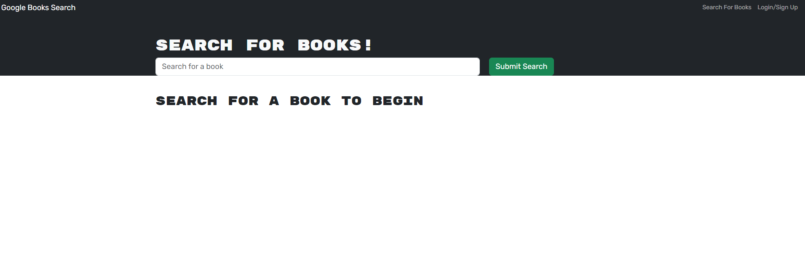
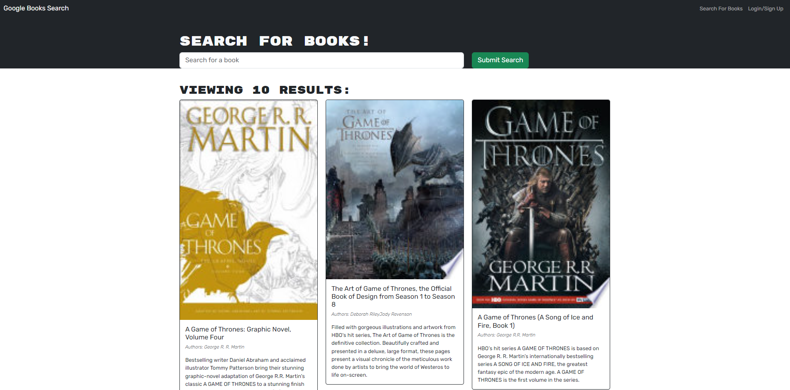
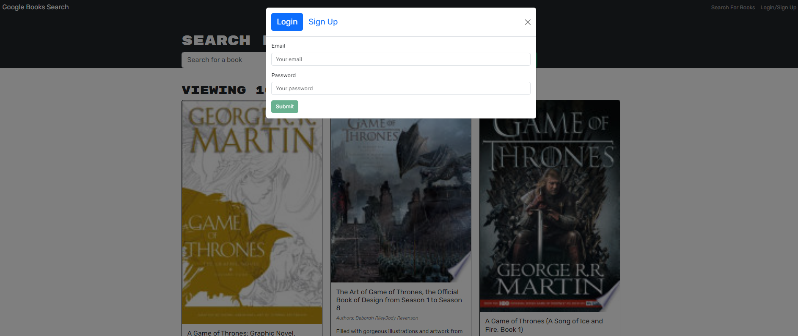

# MERN Book Search Engine

## Description

This application is a Google Books API search engine. The task for this assignment was to refactor the existing code which had a RESTful API to a GraphQL API built with Apollo Server. The App is built using the MERN stack with a React front end, MongoDB database, and Node.js/Express.js server and API.

## Problem Solving

This application can act as a great way for avid readers to find and search for books on the web. This is leveraged through the ability of being able to save books to your account when signed in.

## Learning

Whilst working throughout this project I learned how to turn a RESTful API into a GraphQL API.  

## Table of Contents

- [Installation](#installation)

- [Usage](#usage)

- [License](#license)

- [Contributing](#contributing)

- [Tests](#tests)

- [Questions](#questions)

## Installation

To install and run this project locally, follow these steps:

1. Clone the repository to your local machine.
    
    git clone git@github.com:Y1va/BookSE.git

2. Open the project folder in your code editor.

3. Install the necessary dependencies by running the command:

    `npm install`

4. Once the necessary dependencies have been installed you can fire up the app with the following command

    `npm run develop`

## Usage

* When you first get into the application you can see a search bar. Here is where you can search for books. Enter a book that you would like to find/know more about it and watch as they appear on the screen below. 

* Once you have searched for your desired book you have the option to save them and read more about them in the blurb shown below the book cover. 

* The following screenshot is showing the Login/Sign up section of the application. In order for you to save books, you must have a registered account and be signed in.

## Deployed application to Render

You can access the deployed application which is hosted on Render through this link: [Render Application Link]()

## License

    This project is licensed under the MIT License

## Contributing

I will not be accepting contributions to this repository at this time.

## Tests

N/A

## Questions

If you have any questions, feel free to reach out to me at ponzeadrian@gmail.com. Find my other projects at [Y1va](https://github.com/Y1va/).
